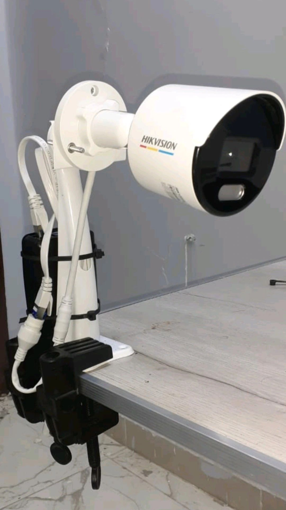
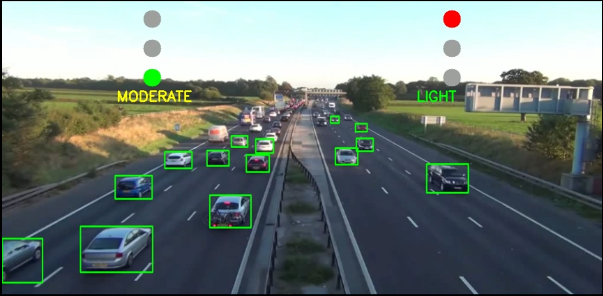
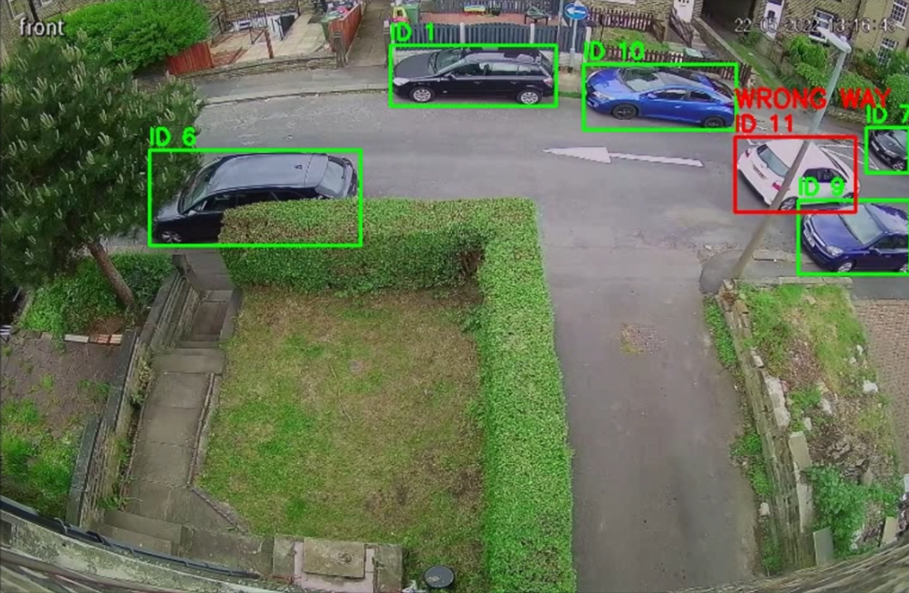
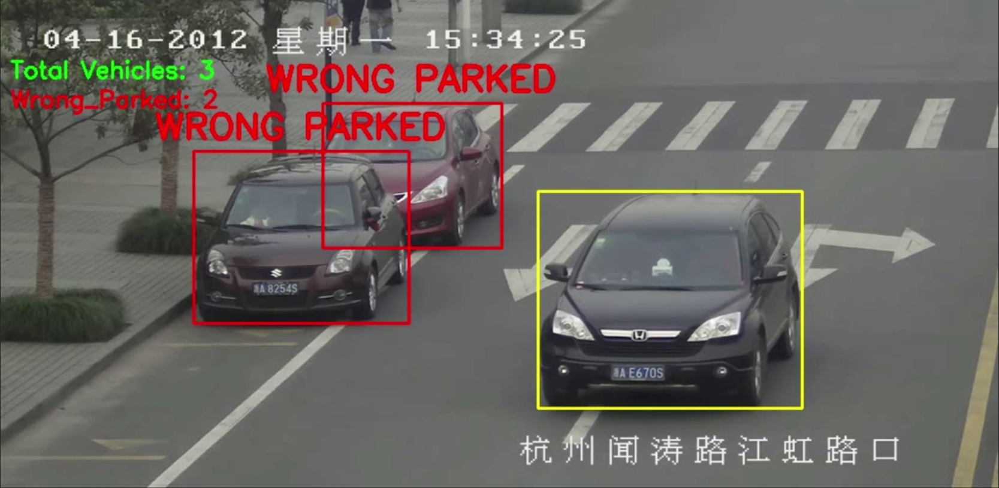

---

# **Smart Traffic AI System**

**Embedded Computer Vision | Real-Time Traffic Optimization | Wrong Parking & Wrong Way Detection | Accident Detection**

---

## **Project Overview**

This project contains a suite of AI systems for **smart traffic management**, designed for **real-time vehicle monitoring, anomaly detection, and traffic optimization**:

1. **Traffic Light Optimization** – Dynamically controls traffic signals based on real-time vehicle density.
2. **Wrong Parking Detection** – Detects stationary vehicles and identifies wrongly parked cars.
3. **Wrong Way Detection** – Monitors traffic lanes for vehicles moving in the wrong direction.
4. **Accident Detection [prototype only - planned for final phase]** – Identifies accidents on the road by detecting abnormal vehicle motion or stoppages.

The system combines **YOLOv8 object detection**, **DeepSORT tracking**, and optional **Firebase integration** for real-time reporting.

---

## **Hardware & Prototype**

The project has **two phases**: **prototype** and **full-scale embedded deployment**.

### **Prototype Phase**

Used for testing the algorithms on a small scale:

| Component              | Purpose                                                             |
| ---------------------- | ------------------------------------------------------------------- |
| ESP32                  | Simulate traffic light signals on small-scale intersections         |
| Toy vehicles           | Represent real traffic for testing traffic optimization logic       |
| Tapo C100 camera       | Capture video of toy traffic environment for detection and analysis |
| Laptop                 | Run YOLO inference and simulate control logic                       |
| Lightweight YOLO model | Detect vehicles in real-time on the prototype setup                 |

---

### **Full-Scale Embedded System (Funded Upgrade)**

Planned for on-road deployment:

| Component                          | Purpose                                                                                |
| ---------------------------------- | -------------------------------------------------------------------------------------- |
| Raspberry Pi 5 (8GB RAM)           | On-device AI inference and traffic control                                             |
| Hikvision DS-2CD1027G0-L IP camera | Outdoor video capture for real-time traffic monitoring                                 |
| Traffic lights                     | Controlled by Raspberry Pi for dynamic signal changes                                  |
| YOLOv8 (optimized)                 | Real-time vehicle detection and traffic density estimation                             |
| Firebase or MQTT                   | Optional cloud integration for status reporting, alerts, and dashboards                |
| Mobile App                         | Allows citizens to monitor traffic and authorities to receive violations and anomalies |


---

💡 **Note:**
The **accident detection module** is currently at **prototype stage** and will be part of the next phase.

---

## **Architecture**

```text
             ┌─────────────────────────┐
             │        Camera/Video     │
             │  (Webcam, IP, MP4)     │
             └─────────┬──────────────┘
                       │
                       ▼
             ┌─────────────────────────┐
             │   Preprocessing Module  │
             │ - Resize frames         │
             │ - Split lanes (traffic)│
             └─────────┬──────────────┘
                       │
                       ▼
    ┌───────────────────────────┐
    │       YOLOv8 Detection     │
    │ - Vehicle detection        │
    │ - Wrong parking detection  │
    │ - Wrong way detection      │
    │ - Accident detection       │
    └─────────┬───────────────┘
              │
              ▼
    ┌───────────────────────────┐
    │   Tracking & Analysis      │
    │ - DeepSORT tracking        │
    │ - Stationary vehicle calc  │
    │ - Lane direction analysis  │
    │ - Abnormal motion analysis │
    └─────────┬───────────────┘
              │
              ▼
    ┌───────────────────────────┐
    │ Visualization & Control    │
    │ - Traffic light signals    │
    │ - Bounding boxes & labels  │
    │ - Accident alerts          │
    │ - Live video stream        │
    └─────────┬───────────────┘
              │
              ▼
    ┌───────────────────────────┐
    │   Optional Cloud Services  │
    │ - Firebase status updates  │
    │ - Alerts & dashboard       │
    └───────────────────────────┘
```

---

## **Folder Structure**

```text
traffic_ai_system/
│
├── inference.py         # Unified inference runner
├── traffic.py           # Traffic signal system
├── parked.py            # Wrong parking detection
├── wrong_way.py         # Wrong-way detection
├── accident.py          # Accident detection
│
├── models/              # Pretrained YOLO models
│   ├── yolov8n.pt
│   └── yolov8s.pt
│
├── outputs/             # Store processed videos & frames
│
├── media/               # Input images or videos
│   ├── traffic_videos/
│   ├── parking_videos/
│   ├── wrongway_videos/
│   └── accident_videos/
│
├── requirements.txt     # Python dependencies
└── README.md
```

---

## **Preparing Media Files**

Place videos or images in the **media/** folder:

* **Traffic:** `media/traffic_videos/`
* **Wrong Parking:** `media/parking_videos/`
* **Wrong Way:** `media/wrongway_videos/`
* **Accidents:** `media/accident_videos/`

Example:

```text
media/
├── traffic_videos/traffic1.mp4
├── parking_videos/parking1.mp4
├── wrongway_videos/road1.mp4
└── accident_videos/accident1.mp4
```

---

## **Running the System**

### **Traffic Light Optimization**

```bash
python inference.py --mode traffic --source media/traffic_videos/traffic1.mp4
```

### **Wrong Parking Detection**

```bash
python inference.py --mode parking --source media/parking_videos/parking1.mp4 --output outputs/parking_result.mp4
```

### **Wrong Way Detection**

```bash
python inference.py --mode wrongway --source media/wrongway_videos/road1.mp4 --output outputs/wrongway_result.mp4
```

### **Accident Detection**

```bash
python inference.py --mode accident --source media/accident_videos/accident1.mp4 --output outputs/accident_result.mp4
```



---

## **Firebase Integration (Optional)**

* Configure Firebase in `traffic.py` or `accident.py`:

```python
cred = credentials.Certificate("path/to/your/firebase.json")
firebase_admin.initialize_app(cred, {
    'databaseURL': 'https://your-database-url.firebaseio.com/'
})
```

* Status updates are automatically sent:

```python
update_firebase_status('road1', 'Accident')
```


---

## **Project Book and Demo Video**

**Book**[https://drive.google.com/file/d/11Q4jhJbcuXXnUtl_lyaJlae39yWCtJ-m/view?usp=sharing]

**Video**[https://drive.google.com/file/d/1aWYLqYVTHfPA0joM5Z6hLrywhT6NqOr_/view?usp=sharing]
